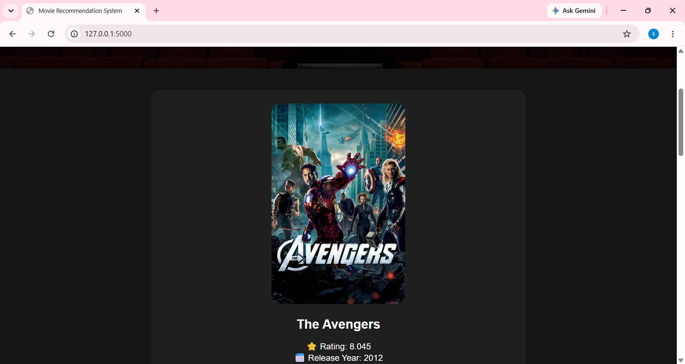
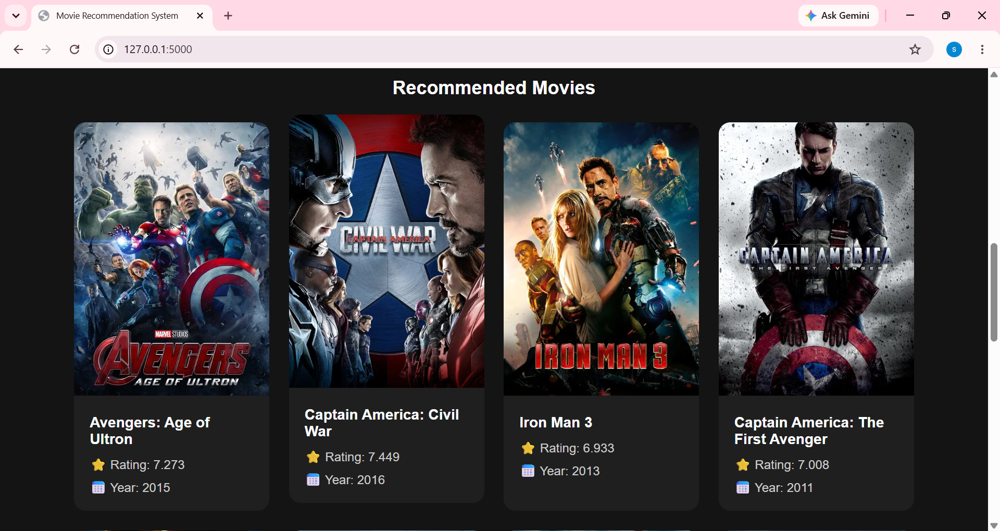

# 🎬 Movie Recommendation System

A Flask-based Movie Recommendation System that recommends similar movies using Content-Based Filtering and the TMDB 5000 Dataset.

---

## 🚀 Features

- Search movies by title
- View movie poster
- View movie rating
- View release year
- Open IMDb page directly
- Get 10 similar movie recommendations
- Responsive and modern UI

---

## 🛠️ Technologies Used

- Python
- Flask
- Pandas
- Scikit-learn
- HTML
- CSS

---

## 📊 Datasets Used

- TMDB 5000 Movies Dataset
- TMDB 5000 Credits Dataset
- Movie Details Dataset (Poster URLs, Ratings, Release Year)

---

## 📸 Screenshots

### Home Page


### Search Results



### Recommendations



---

## ⚙️ Run Locally

### 1. Clone the repository

```bash
git clone https://github.com/Saravananc05/movie_recommendation_system.git
```

### 2. Navigate to the project directory

```bash
cd movie_recommendation_system
```

### 3. Install the required dependencies

```bash
pip install -r requirements.txt
```

### 4. Run the Flask application

```bash
python app.py
```

### 5. Open in your browser

```text
http://127.0.0.1:5000
```

---

## 🎯 How to Use

1. Enter a movie title in the search box.
2. Click the **Recommend** button.
3. View:
   - Movie Poster
   - Movie Rating
   - Release Year
   - IMDb Link
4. Explore similar movie recommendations.
5. Click on any movie title to view more details on IMDb.

---

## 🔍 Example Searches

- Titanic
- Avatar
- Batman Begins
- The Dark Knight
- Iron Man
- Avengers
- Inception
- Interstellar

---

## 🧠 Recommendation Technique

This project uses **Content-Based Filtering**.

Movies are compared based on:

- Genres
- Keywords
- Overview
- Cast
- Director

The similarity between movies is calculated using:

- Count Vectorization
- Cosine Similarity

---

## 📁 Important Files

- `app.py` — Flask application
- `recommendation.py` — Recommendation engine
- `tmdb_5000_movies.csv` — Movies dataset
- `tmdb_5000_credits.csv` — Credits dataset
- `movie_details.csv` — Posters, ratings and year data
- `templates/index.html` — Frontend page
- `static/style.css` — Styling

---

## 👨‍💻 Author

**Saravanan**

GitHub: https://github.com/Saravananc05

---

## 📄 License

This project is licensed under the MIT License.